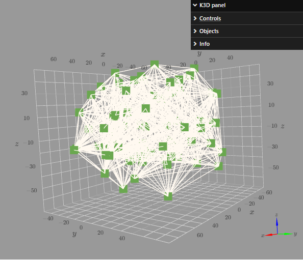
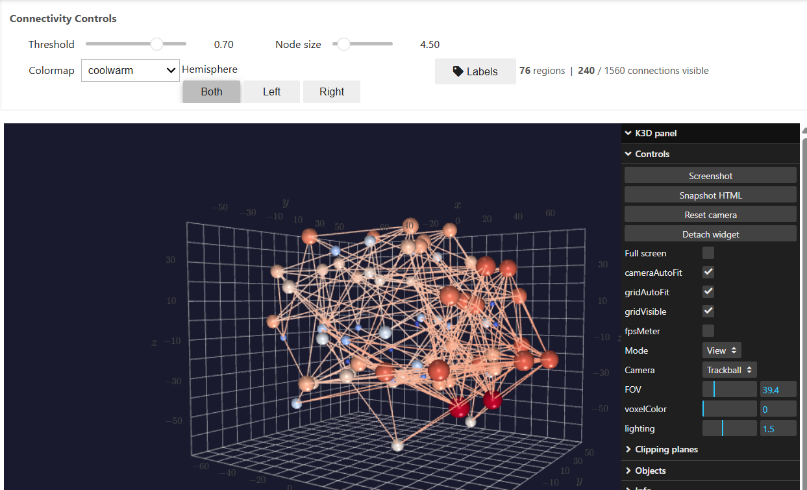
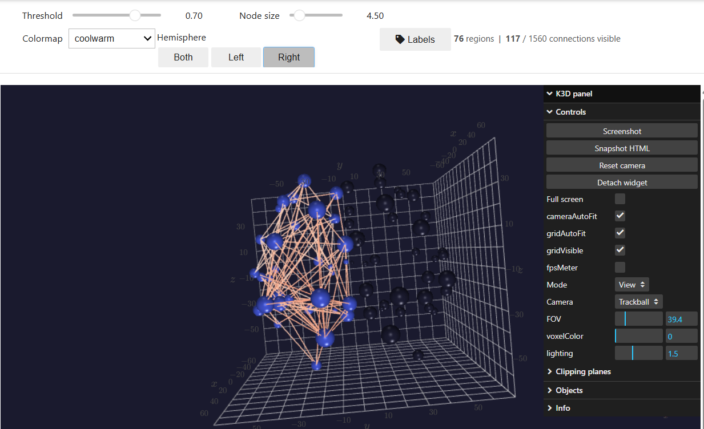
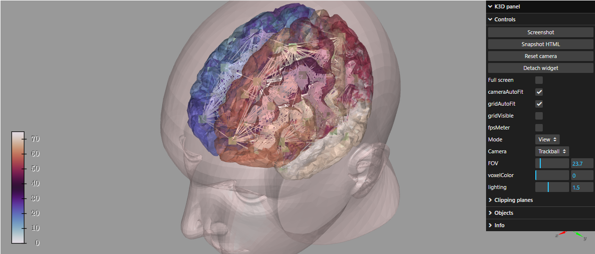
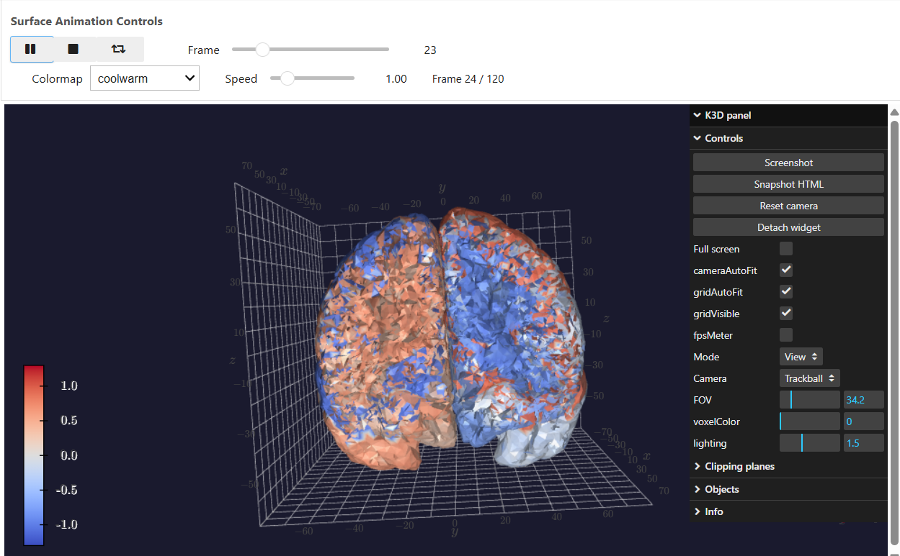

# tvb-widgets-poc

> New 3D graphical widgets for [The Virtual Brain](https://www.thevirtualbrain.org/) JupyterLab ecosystem — GSoC 2026 Project #11 proof-of-concept.

Built on top of the existing [tvb-widgets](https://github.com/the-virtual-brain/tvb-widgets) architecture (same `k3d` + `ipywidgets` stack, same `add_datatype()` API, same base class conventions) — extending it with features the current ecosystem does not have.

---

## What's New

### Connectivity3DWidget

The existing `HeadWidget` renders brain regions as flat 2D icons with uniform white edges and no interactive controls. This widget replaces that with a scientifically meaningful 3D representation.

| Before — `HeadWidget` (existing) | After — `Connectivity3DWidget` (this PoC) |
|:---:|:---:|
|  |  |
| Grey background · Flat 2D icon nodes · Uniform white edges · **No controls** | Dark background · Hub-sized 3D spheres · Strength-mapped colormap · **5 live controls** |

**Hub-proportional node sizing** — node size encodes total connectivity strength (row-sum of the weight matrix). Hub regions — the most connected brain areas — are rendered visibly larger than peripheral nodes. No existing TVB widget does this.

**Strength-mapped colormap** — each node is coloured by its connectivity strength through the selected colormap (viridis / plasma / hot / coolwarm / rainbow). Colormap changes propagate to both nodes and edges live, with no plot rebuild.

| Both hemispheres | Right hemisphere isolated |
|:---:|:---:|
|  |  |

**Live controls — all update the 3D view without rebuilding the plot:**

| Control | What it does |
|---------|-------------|
| Threshold slider | Hides connections below a weight fraction — reveal only the strongest structural pathways |
| Node size slider | Scales all nodes while preserving hub/peripheral size ratio |
| Colormap dropdown | Remaps both node and edge colours through 5 colormaps |
| Hemisphere toggle | Isolates left / right hemisphere connectivity — inactive nodes rendered black |
| Labels toggle | Shows floating 3D labels for the top-10 hub regions by connectivity strength |

---

### AnimatedSurface3DWidget

No equivalent exists anywhere in the tvb-widgets ecosystem. This widget renders the full TVB cortical surface mesh (~16k vertices, ~33k triangles) and animates a timeseries array by mapping scalar values to a diverging colormap per vertex, per frame — with no mesh rebuild between frames.

| Static view | During playback |
|:---:|:---:|
|  |  |
| Original static surface — `HeadWidget` | Per-vertex neural activity animated at 12 fps — `AnimatedSurface3DWidget` |

Only the vertex attribute buffer is mutated on each frame via k3d's traitlet system. A `(120, 16384)` float32 timeseries array consumes ~7.9 MB. The full animation runs at 12 fps on a standard JupyterLab environment with no GPU required.

**Playback controls:**

| Control | What it does |
|---------|-------------|
| Play / Pause / Loop | Standard playback — `jslink` syncs UI counter client-side, Python observer handles k3d mutation |
| Frame slider | Scrub to any frame — bidirectionally synchronised with Play |
| Speed slider | 0.25× – 4× — adjusts `Play.interval` in ms |
| Colormap dropdown | 5 diverging colormaps (coolwarm / RdBu / seismic / bwr / PRGn) — appropriate for signals that oscillate above and below a resting baseline |

---

## Quick Start

```bash
git clone https://github.com/mohitr2111/tvb-widgets-poc
cd tvb-widgets-poc
pip install -e .
jupyter lab
```

Open `notebooks/demo_widgets.ipynb` and press **Run All**.

No EBRAINS account. No `CLB_AUTH` token. No file downloads. All data comes from the `tvb-data` pip package.

---

## Usage

### Connectivity3DWidget

```python
from tvb.datatypes.connectivity import Connectivity
from tvbwidgets_poc import Connectivity3DWidget

conn = Connectivity.from_file()
conn.configure()

w = Connectivity3DWidget(conn)
display(w)
```

### AnimatedSurface3DWidget

```python
from tvb.datatypes.surfaces import CorticalSurface
from tvbwidgets_poc import AnimatedSurface3DWidget

surf = CorticalSurface.from_file()
surf.configure()

# Synthetic timeseries auto-generated (8 pseudo-regions, distinct frequencies)
w = AnimatedSurface3DWidget(surf)
display(w)

# Or with real TVB simulation output:
# ts = simulator_result.astype('float32')  # shape (T, N_vertices)
# w = AnimatedSurface3DWidget(surf, timeseries=ts)
```

---

## Architecture

Both widgets follow the existing `tvb-widgets` pattern exactly:

```
TVBWidgetPOC  (base_widget.py)
  ├── ipywidgets.VBox + TVBWidgetPOC  multiple inheritance — same as HeadWidget
  ├── k3d.plot() inside ipywidgets.Output() — correct JupyterLab DOM placement
  ├── add_datatype(HasTraits)  — public API, maps to xircuits input port
  └── _to_float32() / _validate_connectivity()  — shared base utilities

Connectivity3DWidget  (connectivity3d.py)
  └── k3d.points (point_sizes array) + k3d.lines
      Live mutation: .colors, .point_size, .indices — no plot rebuild on any interaction

AnimatedSurface3DWidget  (surface3d.py)
  └── k3d.mesh with .attribute mutation per frame
      jslink (Play ↔ Slider UI sync) + .observe() (Python k3d mutation)
```

The `add_datatype()` entry point on both widgets maps cleanly to an xircuits input port, following the `PhasePlaneWidget` integration already present in [tvb-ext-xircuits](https://github.com/the-virtual-brain/tvb-ext-xircuits).

---

## Tests

```bash
pytest tests/ -v
```

```
tests/test_connectivity3d.py::test_widget_instantiates_with_connectivity    PASSED
tests/test_connectivity3d.py::test_widget_instantiates_without_data         PASSED
tests/test_connectivity3d.py::test_connectivity_info_structure              PASSED
tests/test_connectivity3d.py::test_threshold_callback_reduces_visible_edges PASSED
tests/test_connectivity3d.py::test_hemisphere_filter_left_right_sum         PASSED
tests/test_connectivity3d.py::test_edge_indices_dtype_is_uint32             PASSED
tests/test_surface3d.py::test_widget_instantiates_with_surface              PASSED
tests/test_surface3d.py::test_synthetic_timeseries_shape_and_dtype          PASSED
tests/test_surface3d.py::test_custom_timeseries_accepted                    PASSED
tests/test_surface3d.py::test_frame_change_updates_mesh_attribute           PASSED
tests/test_surface3d.py::test_speed_change_updates_play_interval            PASSED

11 passed in ~5.3s
```

Tests cover widget instantiation, data loading, callback correctness, dtype guarantees, and hemisphere symmetry.

---

## Design Notes

**Why k3d and not pyvista/trame?**
Consistency with the existing codebase. `HeadWidget` and `SpaceTimeWidget` both use k3d. The widget architecture is designed so the rendering backend is swappable — `_to_float32()` and `_validate_connectivity()` are backend-agnostic utilities on the base class. A pyvista backend can be added as an alternative without restructuring either widget.

**Per-vertex vs per-edge coloring on connections**
`k3d.lines` with `indices_type='segment'` shares the vertex colour buffer — one colour per brain region, not per edge. Node colours are derived from mean incident-edge weight per region. True per-edge colouring would require individual `k3d.line` objects per edge, at some rendering cost for dense connectomes. This is documented as a known trade-off, not a hidden limitation.

**Hemisphere filter label convention**
The hemisphere toggle identifies regions by label prefix (`l` / `r`) — the naming convention of the TVB 76-region default dataset. Connectivity objects with different naming conventions require a custom region index mapping.

---

## GSoC 2026

This repository is a proof-of-concept for [GSoC 2026 Project #11 — The Virtual Brain: New graphical widget(s) for JupyterLab](https://neurostars.org/t/gsoc-2026-project-11-the-virtual-brain-new-graphical-widget-s-for-jupyterlab/35570) with The Virtual Brain / INCF.

**Mentors:** Lia Domide (lead) · Paula Prodan · Teodora Misan